## Общая информация

**Скверъ** предназначен для облегчения работы экпертов и участников во время проведения мероприятий и
чемпионатов AtomSkills и подобных.
Ниже представлена документация по основному процессу работы с системой.

## Добавление пользователей

Первое, что нужно сделать после развертывания системы - добавить пользователей. Убедитесь, что вы зашли
в систему под пользователем Администратор. Стандартный пароль от администратора **ghjcnjq**.

**После развертывания,мы настоятельно рекомендуем сменить пароль от пользователя администратора в профиле.**

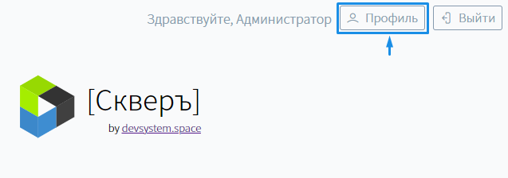

Для добавления пользователей перейдем в пункт меню **Управление пользователями**

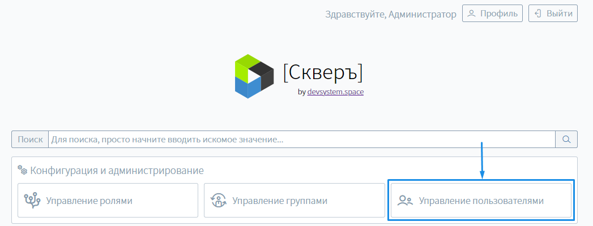

Итак, добавить пользователей можно двумя способами:

1. С помощью формы заведения нового пользователя (кнопка **Создать**)
2. Импорт пользователь из файла .xlsx

### Создание пользователя через форму

Для первого способа нужно нажать на кнопку **Создать**

По нажатию кнопки возникнет диалог
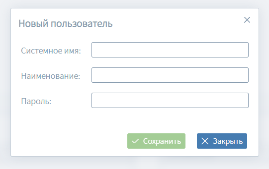

Вводим необходимые данные:

* **Системное имя** - оно используется как логин при входе. Должно содержать только английские буквы
* **Наименование** - это ФИО пользователя.
* **Пароль** - это базовый пароль пользователя для первого входа. Мы настоятельно рекомендуем оповещать пользователя о
  необходимости его смены после входа в систему.

После заведения данных нужно нажать на кнопку **Сохранить**.
После чего форма будет закрыта и новый пользователь появится в таблице пользователей.

### Создание пользователей через импорт данных

Для создания больших количеств пользователей сразу мы рекомендуем пользоваться импортом через xlsx
Для этого вам следует скачать шаблон для импорта
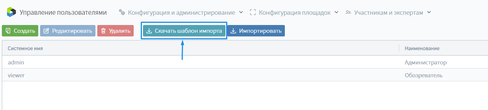

После чего на ваш компьютер будет скачан файл **Скверъ__шаблон_импорта_пользователей.xlsx**
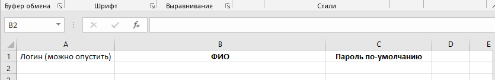

Здесь так же нужно заполнить требуемые поля:

* **Логин** - оно используется как логин при входе. Его можно опустить, **но ФИО в таком случае надо указать полностью**
* **ФИО** - ФИО пользователя. **Обязательно к заполнению**
* **Пароль по-умолчанию** - это базовый пароль пользователя для первого входа. **Обязательно к заполнению**

После заполнения шаблона его следует импортировать в систему
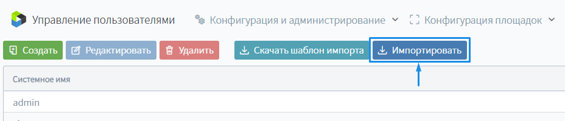

После этого действия данные о пользователях будут внесены в систему.

* **Поскольку импорт не грузит дубли, можно пользоваться одним файлом и дополнять его по мере необходимости.**

## Управление площадками

### Добавление площадки

Для добавления площадок следует выбрать пункт меню **Управление площадками**
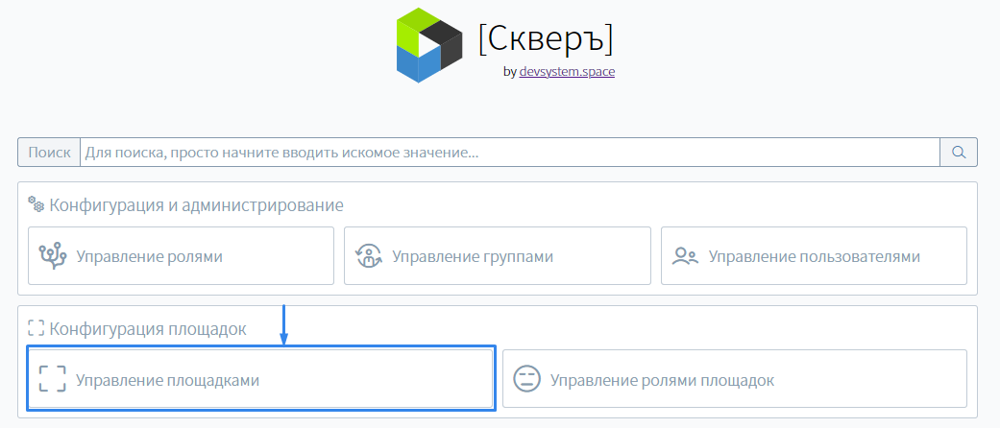

В открывшемся окне нажать на кнопку **Создать**

По нажатию на кнопку откроется форма добавления новой площадки
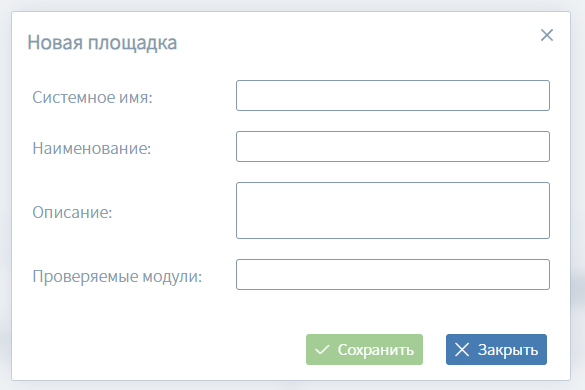

В нем требуется заполнить 3 поля:

* **Системное имя** - Название площадки на английском языке (обычно название компетенции на англ. языке) **Обязательное
  **
* **Наименование** - Название площадки (оно же название компетенции) **Обязательное**
* **Описание** - Более полное описание площадки/компетенции (не обязательно к заполнению)

После заполнения формы при нажатии на кнопку **Сохранить** площадка будет создана.

### Назначение ролей

Для назначения ролей нужно пройти на вкладку **Роли на площадке** в окне **Управление площадками**
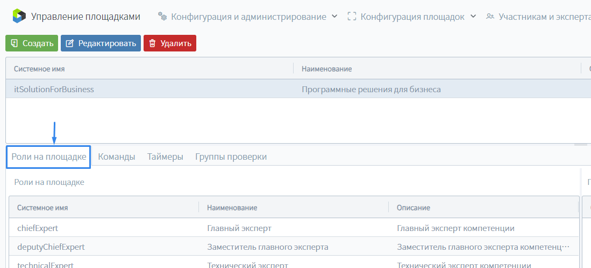

При выборе роли, в правой нижней части экрана отобразится список участников этой роли.
Для изменения состава роли следует нажать на кнопку **Редактировать**
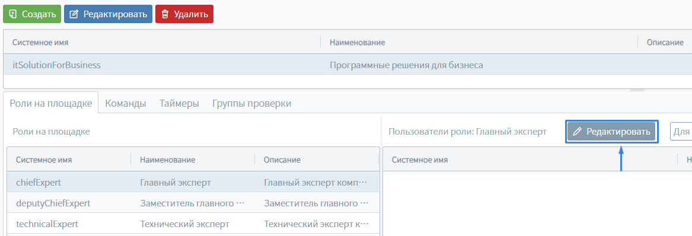

Выберите нужного пользователя и нажмите на кнопку добавления (зеленый плюс)
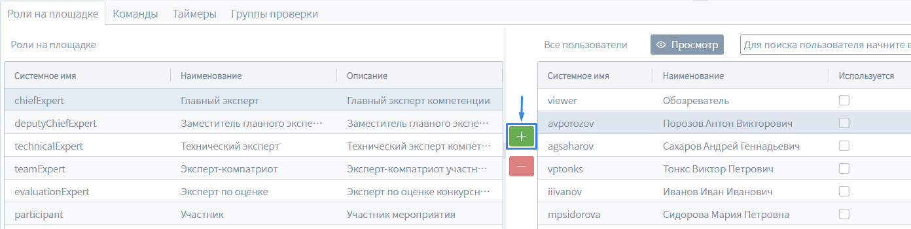

После чего у данного пользователя сменится состояние в колонке **Используется**
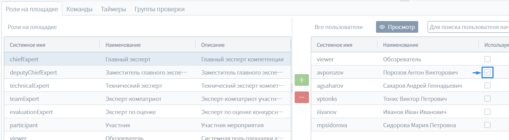

Если вам нужно убрать пользователя из роли, тогда просто нажмите на кнопку удаления (красный минус)
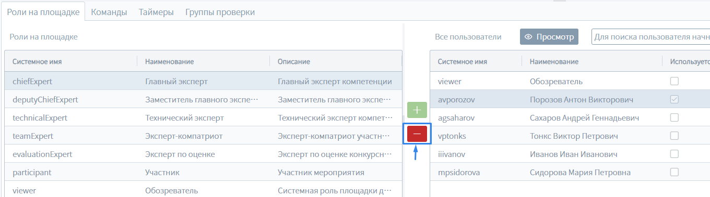

После назначения всех требуемых пользователей на роли, следует выйти из режима редактирования для просмотра
результата
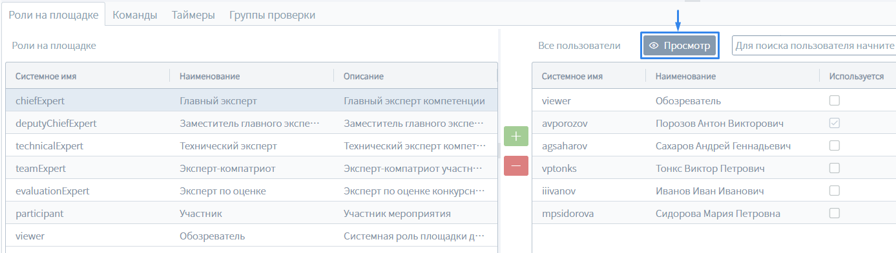

В таблице отобразятся все пользователи, назначенные на соответствующую роль, выбранную в левой таблице
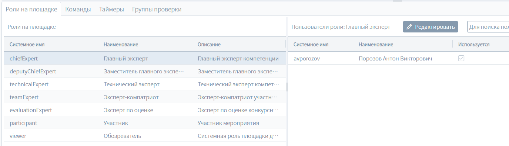

### Формирование команд

Формирование команд опирается на пользователей в ролях площадки, поэтому важно, чтобы роли для формирования
были назначены.

Формирование команд производится на вкладке **Команды**
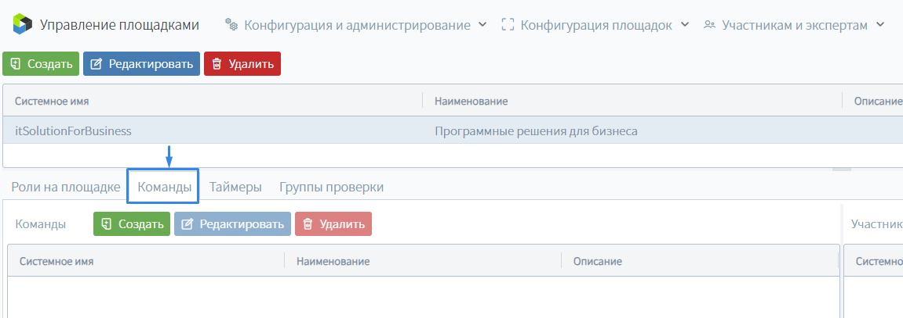

Для создания новой команды следует нажать на кнопку **Создать**
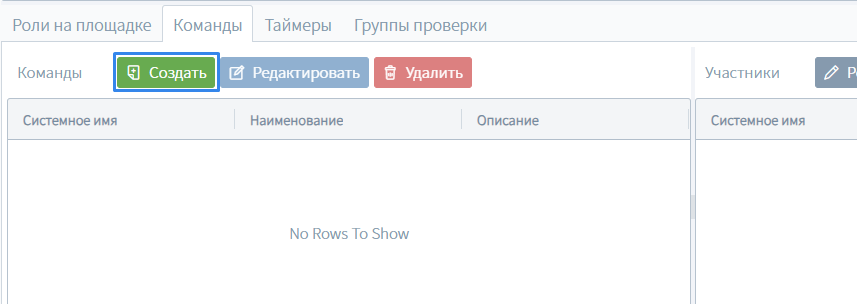

После нажатия на кнопку откроется форма заведения данных о команде
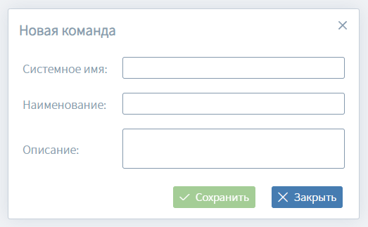

В нем требуется заполнить 3 поля:

* **Системное имя** - Название команды на английском языке **Обязательное**
* **Наименование** - Наименование команды **Обязательное**
* **Описание** - Более полное описание команды (не обязательно к заполнению)

После заполнения полей и нажатия на кнопку **Сохранить** в списке команд появится искомая команда.

Чтобы наполнить команду участниками, следует выделить команду, и нажать на кнопку **Редактировать**
в правой нижней части экрана
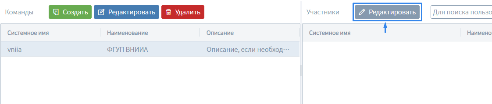

После чего откроется список всех участников и экспертов-компатриотов на площадке.
Для добавления искомого участника или эксперта в команду следует нажать на соответствующую кнопку добавления
(зеленый плюс)
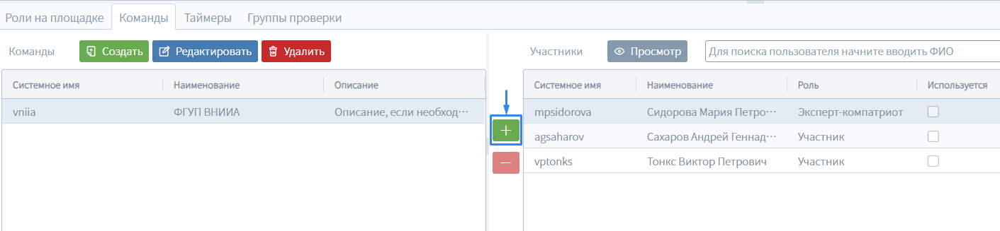

Если требуется исключить человека из команды - просто выберите его и нажмите на кнопку исключения (красный минус)
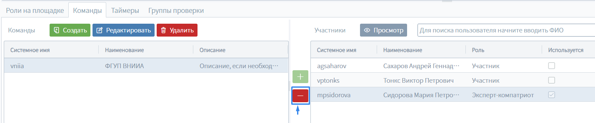

После заведения всех необходимых членов команд вернитесь в режим просмотра (соответствующая кнопка в правой нижней части
экрана)
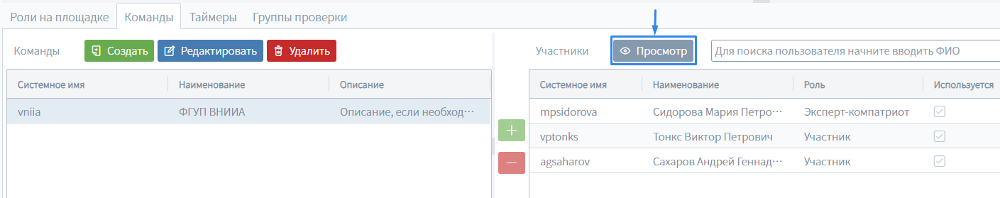

В правой таблиц будут находится все добавленные вами участники команды
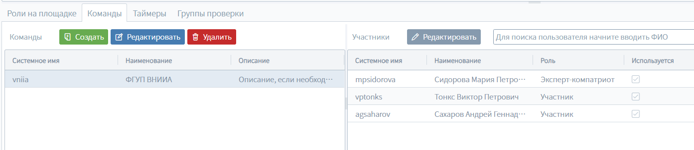

### Работа с таймерами

Для работы с таймерами нужно перейти во вкладку **Таймеры**
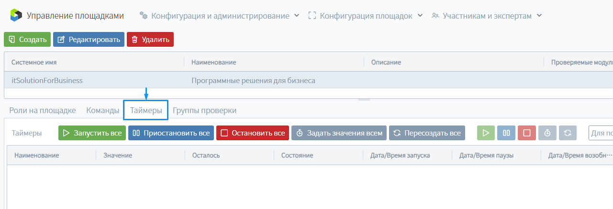

Перед началом работы с таймерами их нужно создать/пересоздать. Сделать это можно нажатием кнопки **Пересоздать все**
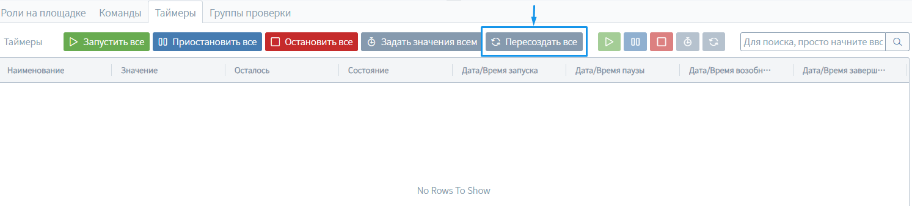

После нажатия данной кнопки создадутся таймеры, их можно запустить одноименными кнопками запустить приостановить и
остановить.
После остановки таймера, чтобы воспользоваться им далее - его нужно будет пересоздать.
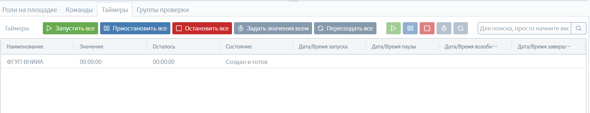

Для задания значения таймерам можно воспользоваться одноименной кнопкой
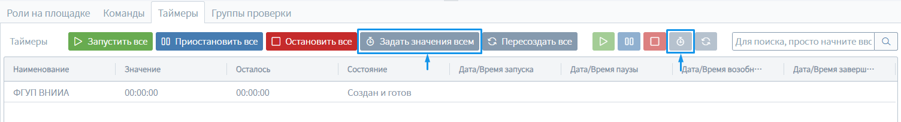
После нажатия откроется форма
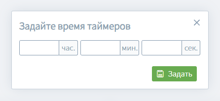

Для приостановки таймера требуется ввести комментарий, из за чего таймер приостанавливается.
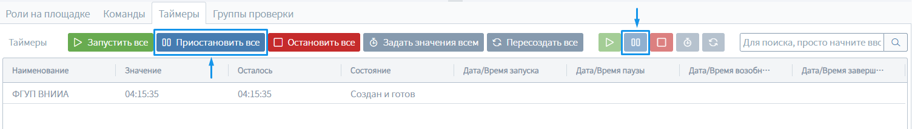
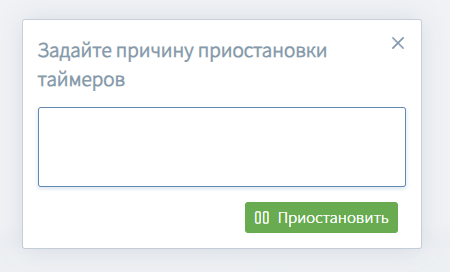

После создания таймеров у участников команд появится возможность просмотреть таймеры в окне **Просмотр таймеров**
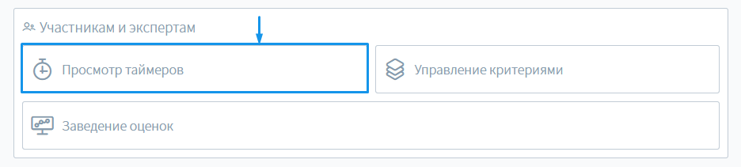

а также в профиле участника
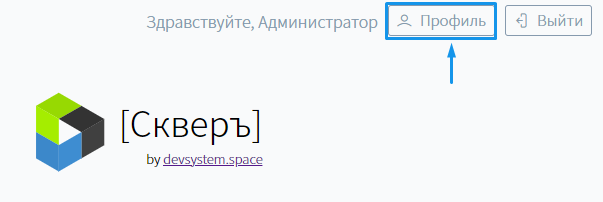
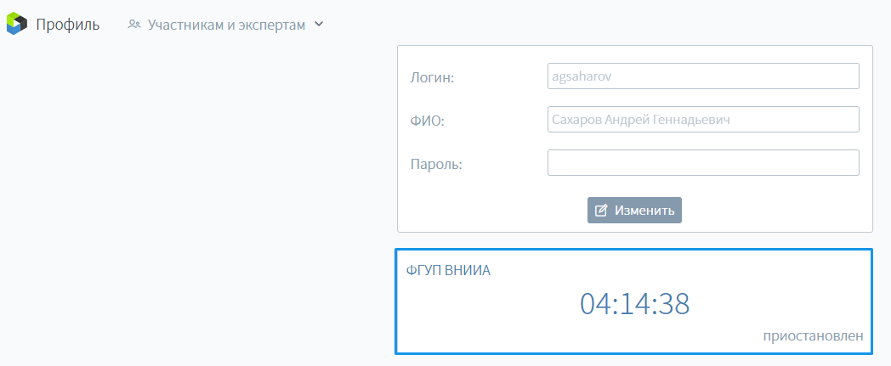

### Управление критериями

Далее следует определиться с критериями. Для этого следует зайти в окно **Управление критериями**
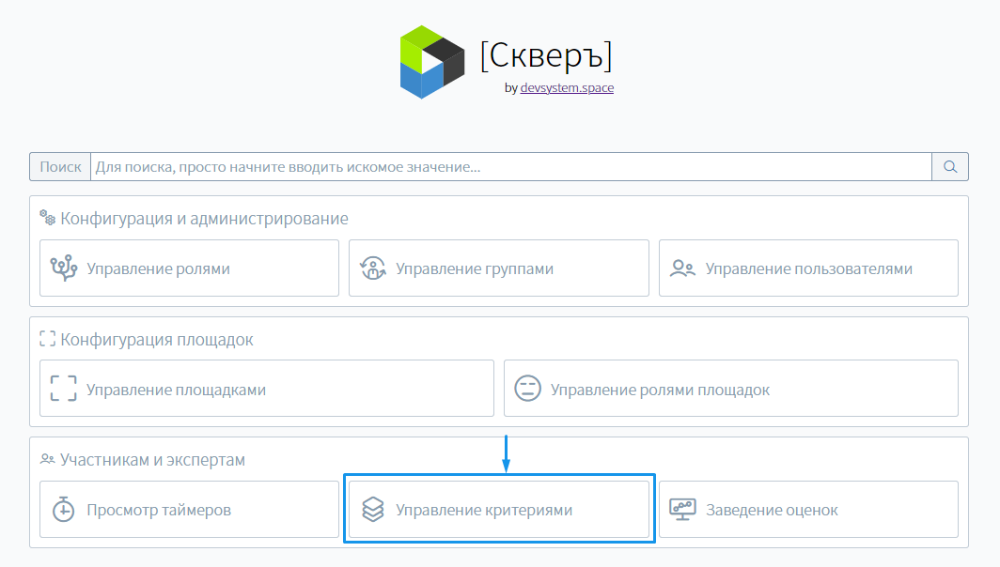

После входа в окно управления критериями есть два способа для заведения критериев в систему:

1. Ручной ввод критериев
2. Импорт критериев из платформы через стандартный excel файл

#### Ручной ввод критериев и изменение

Для ручного ввода критерия нажмите соответствующую кнопку в интерфейсе
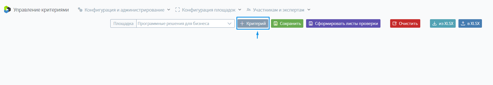

После добавления заполните необходимые поля, после чего заведите субкритерии с помощью одноименной кнопки
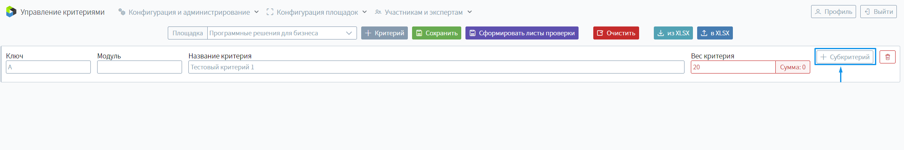

Для добавления аспектов так же существует кнопка в форме субкритериев
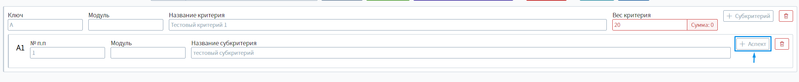

Для удаления любого элемента (сверху-вниз: критерий, субкритерий, аспект) есть кнопка с изображением урны красного цвета
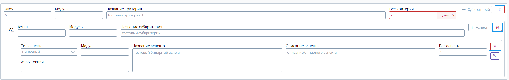

Система работает с 4 типами критериев

**Бинарный**
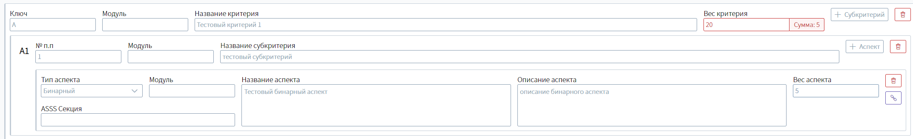

**Дискретный**
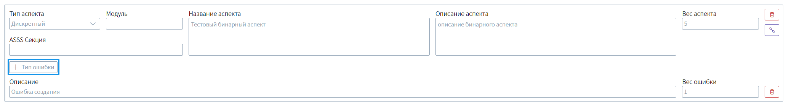

**Судейский**
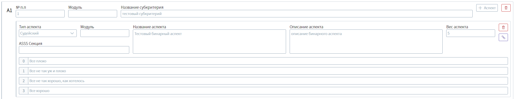

**Отсекаюший**
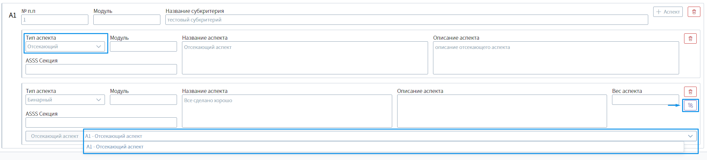

Любой аспект в управлении критериев можно связать с любым отсекающим
аспектом. При этом реализован выбор отсекающих аспектов в формате (субкритерий - имя отсекающего аспекта) для
удобства навигации. Для отключения связи с отсекающим критерием, следует нажать кнопка разлинковать, в правой части
формы аспекта.

Для каждого критерия считается сумма его аспектов. Если сумма аспектов не равна весу критерия, то поле ввода
подсветится красным, так как это ошибка и такого быть не должно.
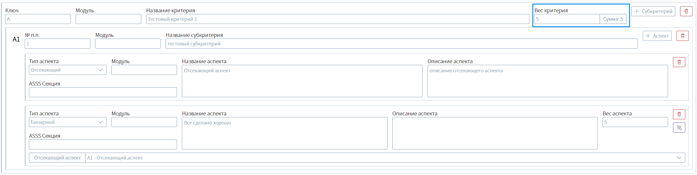

Система так же поддерживает проверку критериев по модулям, для чего в критериях, субкритериях и аспектах
присутствуют соответствующие поля.
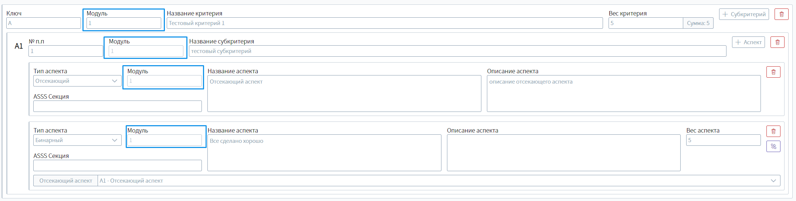

Мы рекомендуем проставлять модули после всех прочих изменений. Важно, что изменение поля модуль, распространяется
на все его дочерние записи, поэтому будьте предельно внимательны при их простановке.

Для использования, готовые критерии должны быть сохранены. Для чего предусмотрена одноименная кнопка
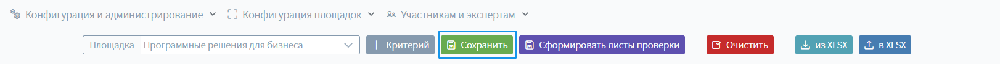

#### Импорт данных из excel

Для импорта нажмите одноименную кнопку
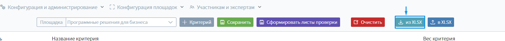

Скверъ работает со стандартными шаблонами платформы, поэтому проблем с импортом файлов из нее не должно вызвать проблем.

Мы так же реализовали возможность выгрузить данные в шаблоне платформы, для более удобного формирования критериев.
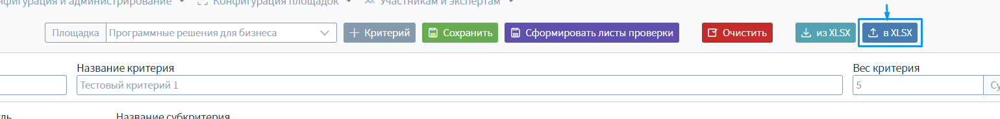

После чего скачается файл критериев по компетенции следующего вида
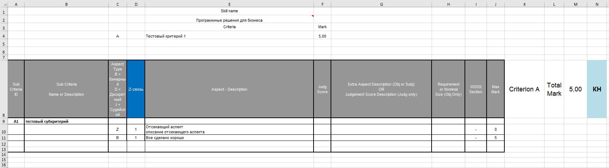

### Группы проверки и проверяемые модули

После заведения критериев и их сохранения (данные в листы проставляются из сохраненных данных системы) возможно
сформировать
листы проверки на каждую из заведенных команд.
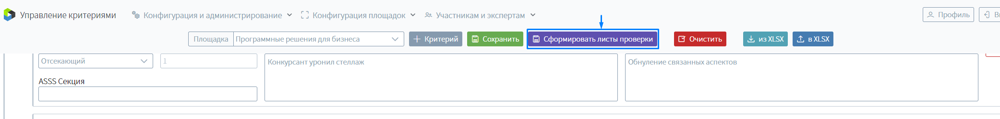

Для того, чтобы начать процедуру проверки следует вернуться в окно управление площадками и завести группы проверки .
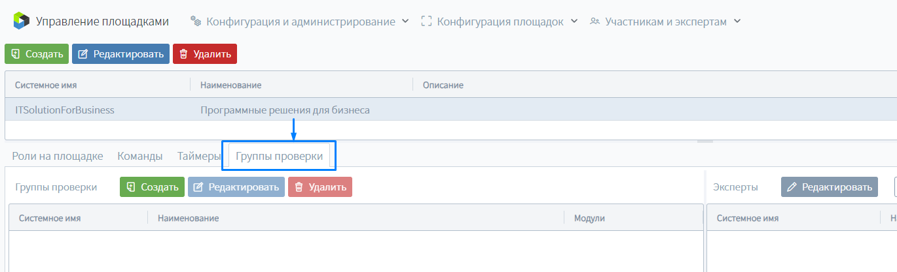

Для создания группы проверки нажмите кнопку **Создать** во вкладке **Группы проверки**. Откроектся форма заполнения
группы проверки
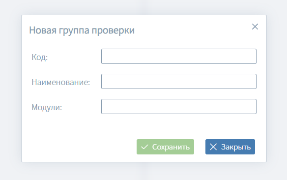

В форме нужно заполнить следующие поля:

* **Код** - системное имя группы проверки (латиницей) **обязательное**
* **Наименование** - наименование группы проверки на русском языке **обязательное**
* **Модули** - это проверяемые группой проверки модули. Перечисляются через запятую без пробелов. (например: 1,2,3)

После создания, следует заполнить группу проверки экспертами. Для этого нажмите кнопку **Редактировать** в правой части
экрана
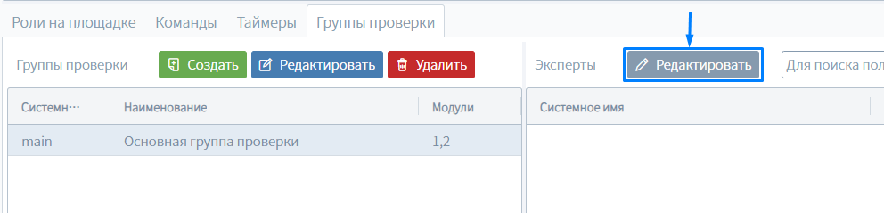

После чего выберите нужного эксперта и нажмите на кнопку **Добавить** (зеленый плюс)
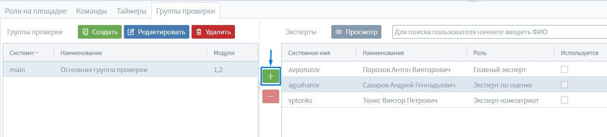

Если нужно убрать эксперта из группы проверки - нажмите на **Убрать** (красный минус)
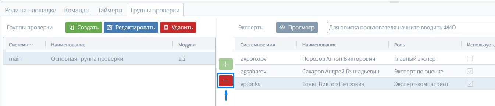

Так же в самой компетенции (площадке) нужно установить, какие модули в данный момент можно проверять
(если задание выполняется частями, то каждый день можно добавлять по 1 модулю).
Делается это в поле **Проверяемы модули**в форме редактирования площадки.
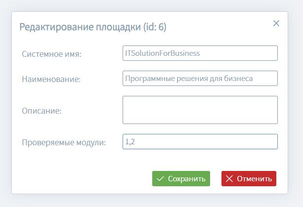

### Заведение оценок

После всех вышеперечисленных действий у экспертов группы проверки откроется возможность заводить оценки. 
Для этого им нужно перейтив пункт меню **Заведение оценок**
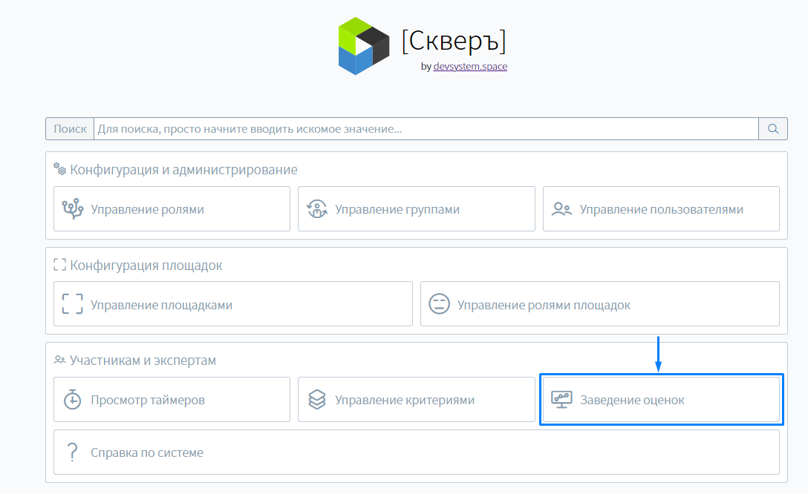

Далее откроется форма, в которой нужно выбрать группу проверки (если вдруг эксперт входит в несколько). Проверяемый
модуль и проверяемую команду. После чего отобразится список аспектов доступных для проверки.
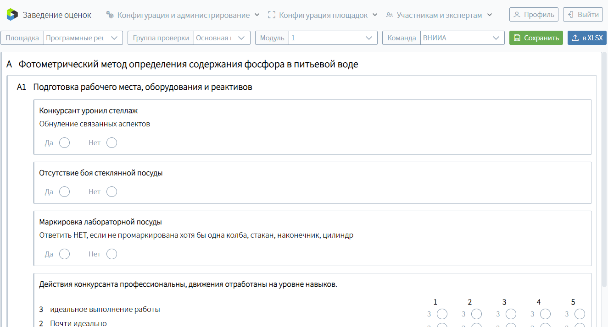

Важно отметить, что в системе реализованы отсекающие аспекты и они так же работают в заведении.
При вводе положительного исхода в отсекающем аспекте, все связанные с ним аспекты будут обнулены, а ввод
оценок для них будет заблокирован. Так же система подскажет, в связи с каким критерием была проведена
блокировка.
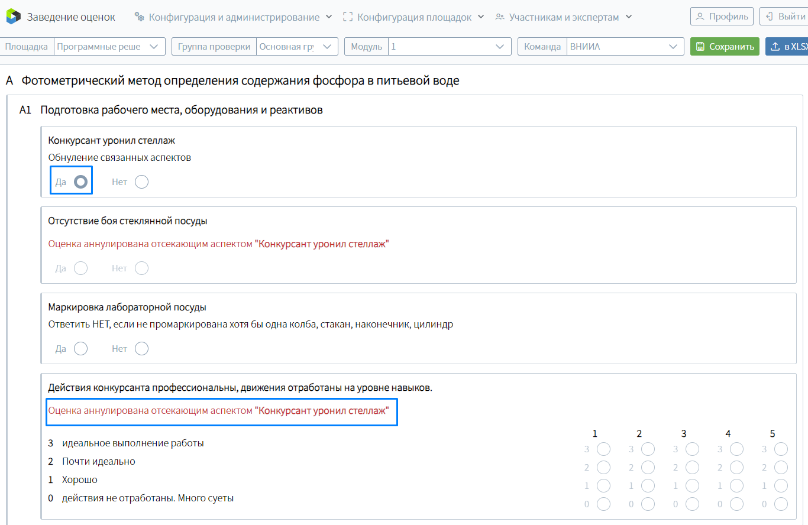

После введения оценок (мы рекомендуем производить это действие сильно чаще) требуется сохранить полученные оценки.
Для этого предусмотрена кнопка **Сохранить**.
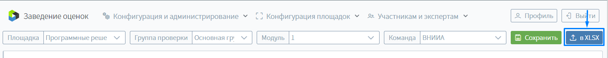

После сохранения ГЭ компетенции может экспортировать данные в эксель для заведения их в платформу (этим же эксель файлом)
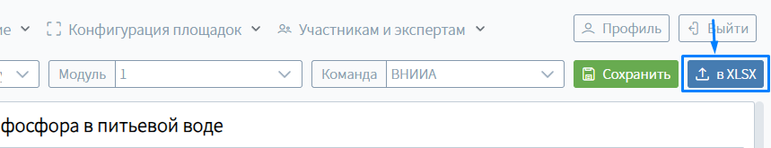

По нажатию на кнопку скачается файл следующего формата
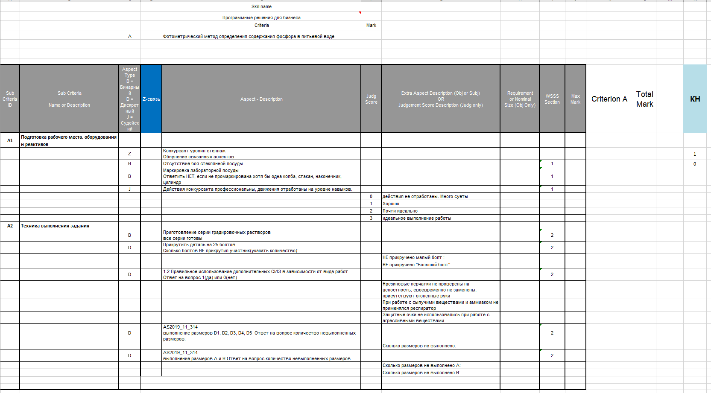
